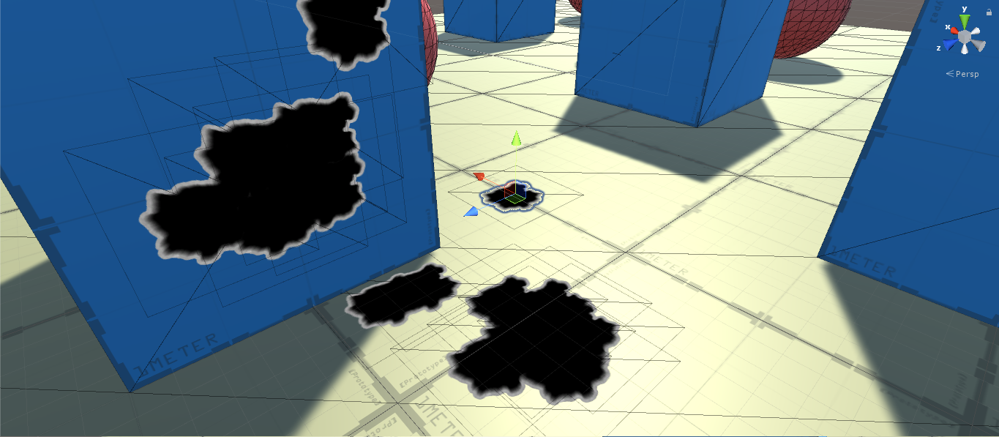
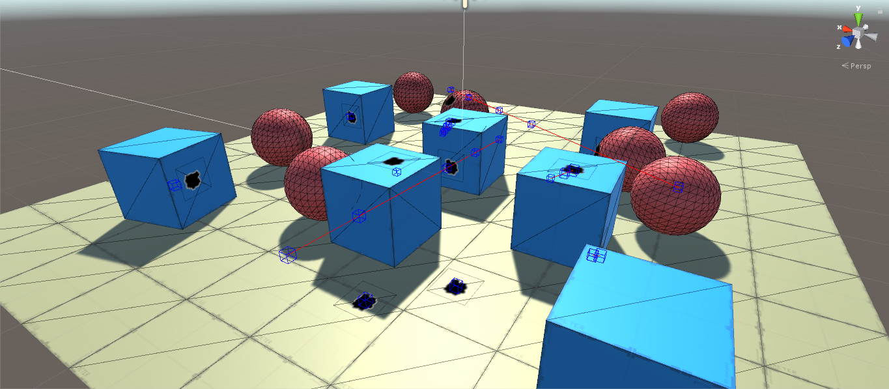

# True-RaycastAll

This asset was created for those who need to use RaycastAll and detect multiple hits on the same object,
bringing information like Ray's entry point and exit, maximum distance, number of hits per Ray casted.
Versatile, fast and practical raycast implementation for shooting games and more, this is **True RaycastAll**.

## ⭐ FEATURES ⭐

	✔️ Contains a demo scene.
	✔️ Fast and easy to understand script.
	✔️ Detects multiple hits on the same object (Unity RaycastAll does not detect).
	✔️ Penetration rate.
	✔️ Point of entry and exit of the projectile.
	✔️ Commented lines.
	✔️ Bonus: A Simple Overlay Shader for Bulletholes.

1. https://www.youtube.com/watch?v=9HLPvgSQYRw
2. https://www.youtube.com/watch?v=b25Mb4wcGR8
3. https://www.youtube.com/watch?v=K_aYgpEEtZw
4. https://www.youtube.com/watch?v=wisa1VGHirU

	
	

